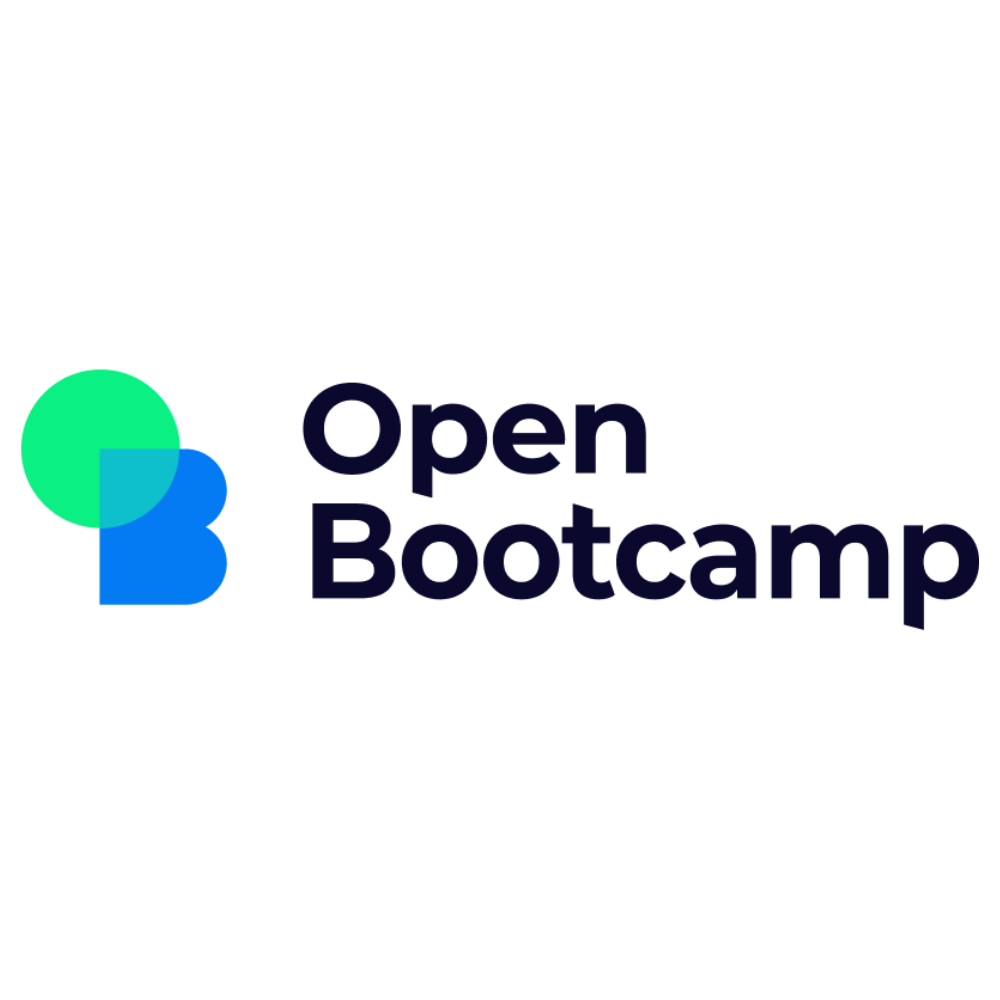

# Curso básico Javascript de OpenBootcamp

# Exercise 1:
Crea un nuevo proyecto de Node, y dentro del package.json crea un script que muestre por pantalla "Hola, este es mi primer ejercicio con Node en el mejor Bootcamp de programación del mundo".

# Exercise 2:
Crea un nuevo archivo JS que contenga una lista con los siguientes elementos:

Tu nombre (string)
Tu edad (number)
¿Eres desarrollador? (boolean)
Tu fecha de nacimiento (Date)
Tu libro favorito (Objeto con propiedades: titulo, autor, fecha, url)
Exercise 3:
Crea los siguientes archivos JS:

factorial-for.js -> Este archivo debe calcular el factorial de 10 utilizando un solo bucle for
factorial-while.js -> Este archivo debe calcular el factorial de 10 utilizando un bucle while
factorial-break.js -> Este archivo debe calcular el factorial de 10 utilizando un bucle while, una bifurcación if y una sentencia break

# Exercise 4:
Crea un archivo JS que contenga las siguientes líneas

Una cadena de texto con tu Nombre
Otra cadena de texto con tu Apellido
Una cadena de texto que se llame "estudiante" concatenando tu Nombre y tu Apellido con un espacio entre medias
Una cadena de texto que se llame "estudianteMayus" que contenga la cadena estudiante pero todo en mayúsculas
Una cadena de texto que se llame "estudianteMinus" que contenga la cadena estudiante pero todo en minúsculas
Una variable que contenga el número de letras de la cadena "estudiante" contando los espacios
Una variable que contenga la primera letra del Nombre
Otra variable que contenga la última letra del Apellido
Una cadena de texto que elimine los espacios de la variable "estudiante"
Una variable booleana que diga si el Nombre está contenido en la variable "estudiante"

# Exercise 5:
Crea un archivo JS que contenga las siguientes líneas

Una variable que contenga tu altura en centímetros (entero)
Una variable que contenga tu altura en metros (número de coma flotante)
Una variable que contenga tu peso en kilogramos (número de coma flotante)
Una variable que contenga tu altura en metros redondeada hacia arriba
Una variable que contenga tu peso en kilogramos redondeado hacia abajo
Una variable que contenga si "el máximo valor que se puede obtener en Javascript + 1" es igual al máximo valor que se puede obtener en Javascript

# Exercise 6:
Crea un archivo JS que contenga las siguientes líneas

Una variable que contenga la lista de la compra (mínimo 5 elementos)
Modifica la lista de la compra y añádele "Aceite de Girasol"
Vuelve a modificar la lista de la compra eliminando "Aceite de Girasol"
Una lista de tus 3 películas favoritas (objetos con propiedades: titulo, director, fecha)
Una nueva lista que contenga las películas posteriores al 1 de enero de 2010 (utilizando filter)
Una nueva lista que contenga los directores de la lista de películas original (utilizando map)
Una nueva lista que contenga los títulos de la lista de películas original (utilizando map)
Una nueva lista que concatene la lista de directores y la lista de los títulos (utilizando concat)
Una nueva lista que concatene la lista de directores y la lista de los títulos (utilizando el factor de propagación)

# Exercise 7.1:
Crea un archivo llamado conjuntos.js que contenga las siguientes líneas

Un nuevo Set con los nombres de tu familia
Modifica el Set original añadiendo tu nombre (duplicado) (debería darte lo mismo)
Modifica el Set original añadiendo el nombre "Javascript" (ya que empieza a formar parte de tu vida ;)

# Exercise 7.2:
Crea un archivo llamado objetos.js que contenga las siguientes líneas

Un objeto con tus datos personales (nombre, apellido, edad, altura, eresDesarrollador)
Una variable que obtenga tu edad a partir del objeto anterior
Una lista que contenga el objeto con tus datos personales y un nuevo objeto con los datos personales de tus dos mejores amig@s
Una nueva lista con los objetos de la lista anterior ordenados por edad, de mayor a menor

# Exercise 7.3:
Crea un archivo llamado fechas.js que contenga las siguientes líneas

La fecha de hoy
La fecha de tu nacimiento
Un variable que indique si hoy es más tarde (>) que la fecha de tu nacimiento
Una variable que contenga el día de tu nacimiento
Una variable que contenga el mes de tu nacimiento (recuerda que Enero es mes 0)
Una variable que contenga el año de tu nacimiento (con 4 dígitos)

# Exercise 7.4:
Abre una nueva ventana "about:blank" en Google Chrome
Abre la consola de desarrollador de Google Chrome (F12)
Pregunta al usuario cuál es su edad y almacénala en una variable llamada edad

# Exercise 8:
Crea un archivo JS que contenga las siguientes líneas

Una función sin parámetros que devuelva siempre "true"
Una función asíncrona que utilice un setTimeout y pase por consola un "Hola soy una promesa" 5 segundos después de haberse ejecutado
Una función generadora de índices pares automáticos

# Exercise 9:
Crea un nuevo proyecto de Node

Instala la dependencia Winston
En el archivo index.js crea una función que devuelva un error con un mensaje personalizado
Registra el error en un archivo a través de un try...catch

# Exercise 10:
Crea un nuevo proyecto de Node

Configura el proyecto para utilizar los módulos de ES6
Crea un archivo controller.js que exporte 2 funciones: suma(a, b) y multiplica(a, b)
En el entrypoint index.js, importa el módulo controller.js
El entrypoint index.js debe utilizar las funciones del módulo para devolver la multiplicación de suma(1, 2) y suma(4, 5)
Instala e importa la librería chalk (https://www.npmjs.com/package/chalk)
Modifica el último console.log del entrypoint index.js para devolver el resultado en color verde

# Exercise 11:
Crea un nuevo fichero JS que contenga las siguientes líneas

Una clase llamada "Estudiante" que tenga:
Una variable llamada nombre
Otra variable lista llamada asignaturas con 3 asignaturas: Javascript, HTML, CSS
Un método "obtenDatos" que devuelva un objeto con las propiedades nombre y asignaturas
Crea una nueva instancia de "Estudiante"
Haz la llamada al método obtenDatos

# Exercise 12:
Crea un nuevo fichero JS que contenga las siguientes líneas

Una función que admita un parámetro "num", y devuelva una lista con esa cantidad de números de la secuencia de Fibonacci (Por ejemplo: num = 6 => Resultado [1, 1, 2, 3, 5, 8])
Ejecuta la depuración de VSCode para visualizar la ejecución de la función

# Exercise 13:
Crea un nuevo proyecto de Node

Instala la dependencia ESLint (https://www.npmjs.com/package/eslint)
Duplica el archivo del ejercicio de la sesión 04-Textos
Utiliza los tres estilos de comillas de forma alterna (comillas simples, dobles, backticks)
Crea el fichero .eslintrc.json
Cambia la configuración de ESLint para que la versión ecmaVersion sea "latest"
Cambia la configuración de ESLint para que muestre un error cada vez que las comillas no sean dobles
Crea un script en el package.json para corregir automáticamente todos los errores
Ejecuta el script a través del terminal

# Exercise 14:
Crea un nuevo proyecto de Node

Instala la dependencia HTTP Server en entorno global (https://www.npmjs.com/package/http-server)
Crea un fichero index.html (utiliza el comando "!")
Crea un fichero index.js
Integra el fichero index.js en el html
Crea un botón en html (Botón)
Vincula un evento de tipo "click" al botón anterior, que muestre una alerta en el navegador "click en el botón"
Crea un script para lanzar un servidor de desarrollo con http-server
Lanza el servidor de desarrollo a través del script anterior y prueba que el botón funciona correctamente
Integra jQuery a través del CDN (https://releases.jquery.com/)
En el fichero index.js crea un evento click en el botón a través de jQuery, que muestre por consola "Hola, estoy utilizando jQuery"

# Exercise 15:
Crea un nuevo proyecto de Node

Crea un fichero index.html (utiliza el comando "!")
Crea un fichero index.js
Integra el fichero index.js en el html
En el fichero index.js:
Crea una variable con tu nombre
Crea una variable con tu apellido
Crea un objeto con tu nombre y tu apellido
Almacena el objeto anterior en la SessionStorage
Almacena el objeto anterior en la LocalStorage
Crea una cookie que caduque en 2 minutos con los datos del objeto anterior
Observa en Google Chrome cómo se almacenan los datos en la SessionStorage, LocalStorage y las cookies
Cierra el navegador, comenta las líneas que almacenan SessionStorage, LocalStorage y CookieStorage y vuelve a abrirlo
Observa cómo la SessionStorage está vacía
Observa cómo la LocalStorage sigue manteniendo el objeto que has almacenado antes de cerrar el navegador
Observa cómo la cookie sigue manteniendo el objeto que has almacenado antes, aunque ya está caducado

# Exercise 16:
Replica el ejercicio completo del vídeo
Añade dos párrafos más en cada una de las secciones
Pon un icono de papelera para eliminar párrafos (Esta imagen puede valer: https://encrypted-tbn0.gstatic.com/images?q=tbn:ANd9GcSSMWeEC0tULzOjfWFAOdOHjUw9WjXhBDbirg&usqp=CAU)
Añade el código necesario para que al arrastrar un fragmento del puzzle a la papelera, éste se elimine

# Exercise 17:
Crea un mapa en HTML
Pon chinchetas en tus 3 lugares favoritos del planeta tierra.